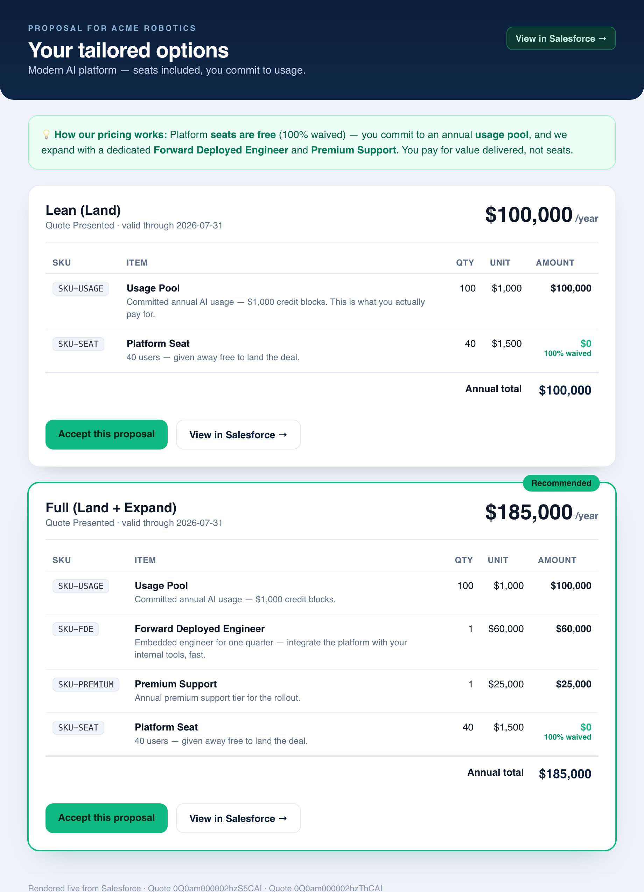
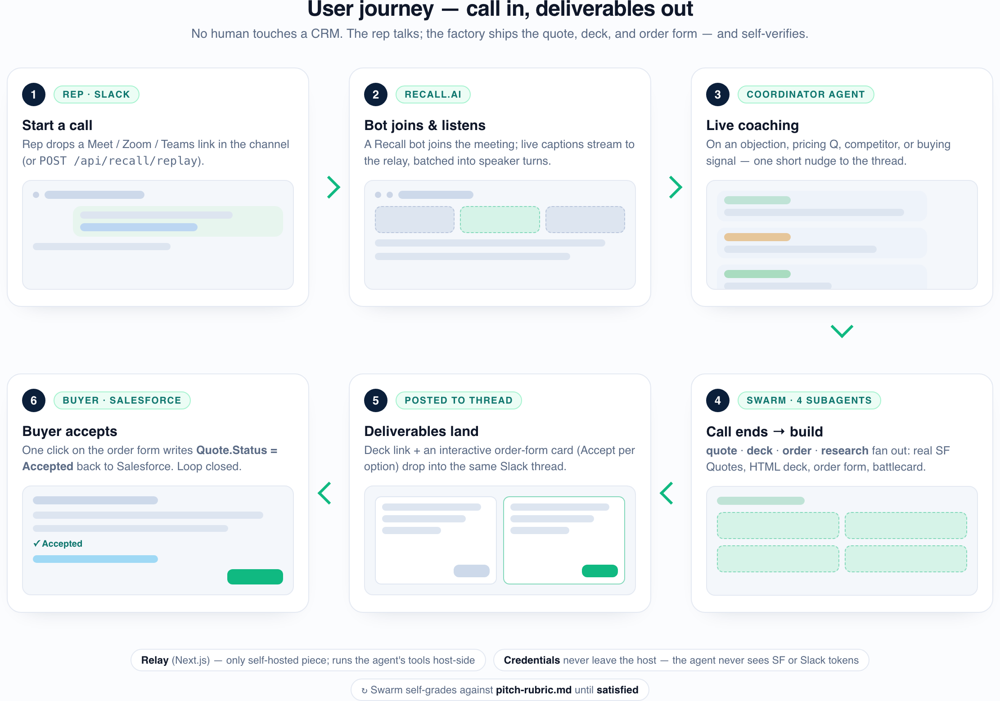
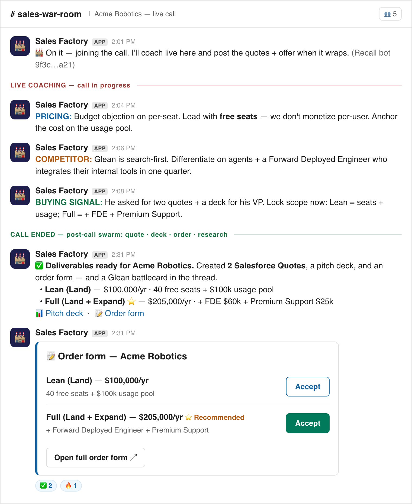
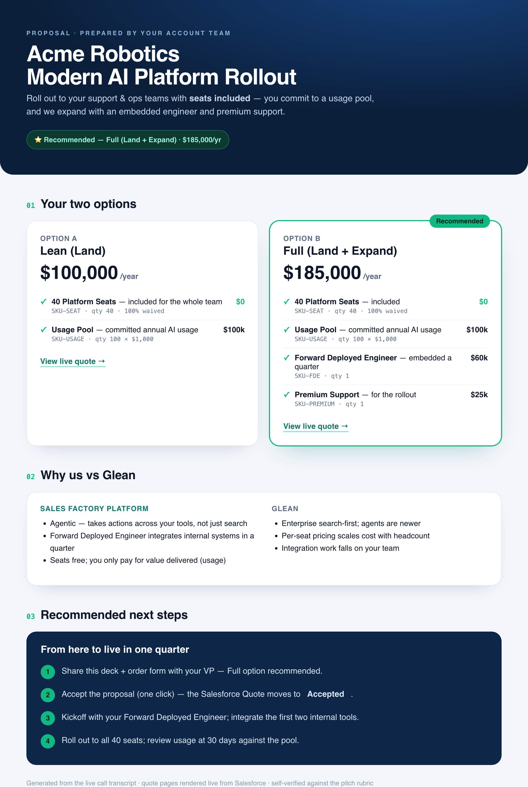
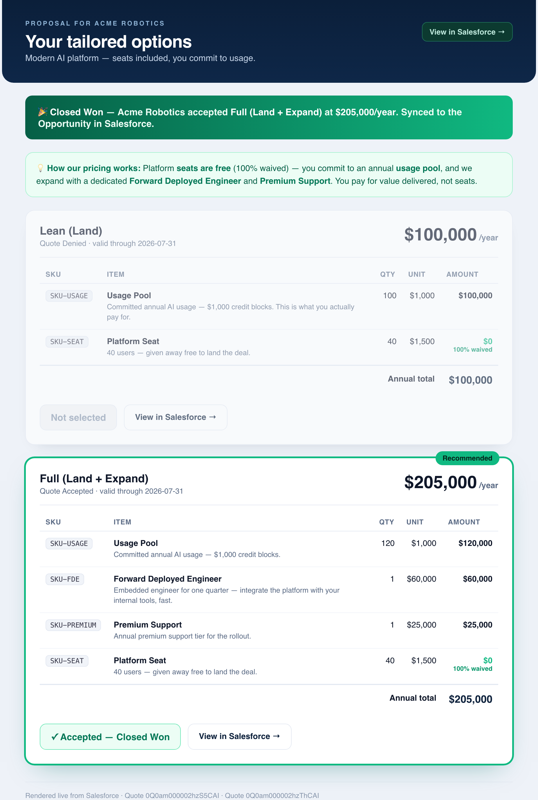

# 🏭 Sales Factory

**Turn a live sales call into real Salesforce quotes, a clickable pitch deck, and a one-click order form — built by a swarm of Claude agents that coach the rep live, then self-verify their own work against a rubric.**

A sales rep's actual job is the *conversation*. Everything wrapped around it — typing the call into the CRM, building two quote options, assembling a deck, cutting an order form, chasing a competitor battlecard — is admin. **The selling is minutes; the paperwork is hours.** Sales Factory keeps the rep human on the call and lets a fleet of agents do the rest.

<sub>Built for **Claude Build Day** on **Anthropic Managed Agents** · model `claude-opus-4-8` · status: **✅ end-to-end verified, no human in the loop**</sub>

<p align="center">
  <a href="https://recall.simple-salesforce.com/pitch.html"><b>▶&nbsp; Open the pitch deck</b></a>
  &nbsp;·&nbsp;
  <a href="https://htmlpreview.github.io/?https://github.com/adamanz/sales-factory/blob/master/public/pitch.html">view the slides on GitHub</a>
  &nbsp;—&nbsp; <sub>problem → how Sales Factory solves it → system architecture</sub>
</p>

<p align="center">
  
</p>
<p align="center"><sub>↑ A <b>real</b> render of the generated order form — two Salesforce Quotes, the recommended option ringed, seats shown as <b>$0 (100% waived)</b>, and an <b>Accept</b> button that writes back to Salesforce.</sub></p>

---

## The opportunity

B2B reps lose their highest-leverage hours to post-call busywork — and miss coaching in the moment when it would actually change the outcome.

| # | Customer pain | What it costs |
|---|---------------|---------------|
| 1 | **Reps do admin instead of selling.** Quotes, decks, and order forms eat post-call hours. | Fewer conversations, slower cycles. |
| 2 | **Quotes are hand-built and error-prone** — invented SKUs, wrong prices, mis-applied discounts. | Margin leaks, rework, broken trust. |
| 3 | **Modern AI pricing is hard to translate live** — free seats to land, a usage pool as the driver, FDE/support to expand. | Reps default to per-seat and lose the deal. |
| 4 | **No coaching in the moment.** Objections, pricing questions, competitors, and buying signals fly by unanswered. | Winnable moments missed. |
| 5 | **Proposals drift from the system of record.** Static PDFs/mockups disconnect from the actual Quote. | The buyer sees something that isn't true. |
| 6 | **Closing the loop is manual.** Someone re-keys the accepted proposal back into Salesforce. | Stalled deals, stale pipeline. |
| 7 | **Multiple options + battlecards are tedious** to track and assemble in time. | Weak, late, inconsistent proposals. |

## The solution

A Recall.ai bot joins the call; the **coordinator agent** (`claude-opus-4-8`) posts short coaching nudges to Slack the moment it hears something coachable. When the call ends, a **swarm of four subagents** does the admin — grounded in the org's real catalog — and then **grades its own output** against [`agents/pitch-rubric.md`](agents/pitch-rubric.md) until it's *satisfied*.

| Pain | How Sales Factory solves it |
|------|------------------------------|
| 1 · Admin over selling | Post-call swarm writes the **real Salesforce Quotes, deck, and order form automatically** — the rep just talks. |
| 2 · Error-prone quotes | **Catalog grounding** (`get_catalog` over live `PricebookEntry`s, `SKU-%` filter) + rubric + `e2e` guarantee real SKUs and list prices. No hallucinated lines. |
| 3 · AI pricing motion | The quote agent encodes it directly: **seats discounted to $0**, **Usage Pool** qty = committed $k as the dollar driver, **FDE + Premium Support** as expansion lines. |
| 4 · No live coaching | Opus 4.8 watches the transcript and fires **trigger-prefixed nudges** (`PRICING:`, `COMPETITOR:`, `BUYING SIGNAL:`) into the Slack thread, <40 words, one per ~20s. |
| 5 · Drift from CRM | The offer page renders **live from Salesforce** — no intermediate copy. Edit the Quote, refresh, it updates. |
| 6 · Manual loop-close | **Accept** writes `Quote.Status=Accepted`, syncs the Opportunity, advances to **Closed Won**, and files the order form as a Salesforce `ContentVersion`. |
| 7 · Options & battlecards | `create_offer` builds a **multi-option** order form with a recommended option + rationale; the research agent `web_search`es competitors into a **battlecard** appendix. |

---

## User journey

> No human touches a CRM. The rep talks; the factory ships the quote, deck, and order form — and self-verifies.



1. **Rep → Slack.** Drop a Google Meet / Zoom / Teams link in the channel (or `POST /api/recall/replay` for the scripted demo). The relay matches the meeting-URL, creates a Recall bot, opens one Slack thread, and starts a Managed Agents session.
2. **Recall.ai → Relay.** The bot joins and streams captions; the relay batches speaker turns into ~15s windows (≈10× fewer session turns).
3. **Coordinator (live).** Stays silent until a coachable moment, then posts one nudge into the pinned thread.
4. **Call ends.** The coordinator flips to the post-call phase and fans out the swarm under a defined outcome.
5. **quote · deck · order · research** run: real Salesforce Quotes (seats at 100% discount + usage pool, expansion option flagged), a self-contained HTML deck linking each option to its quote page, an order form posted to the thread, and a competitor battlecard.
6. **Buyer → Accept.** Opening the order form and clicking *Accept* writes `Quote.Status=Accepted` back to Salesforce, syncs the Opportunity to **Closed Won**, files the agreed form as a `ContentVersion`, and replies in the thread. The swarm grades itself against the rubric until **satisfied**.

---

## What it produces

### 1 · Live coaching in Slack
One thread per call. The coordinator and every subagent reply into it — nudges during the call, deliverables after.

<p align="center"></p>

### 2 · A self-contained HTML pitch deck
One section per option, the recommended one highlighted, each linking to its live quote page, with a competitor battlecard appendix — inline CSS, no external assets. Served at `/api/deck/[id]`.

<p align="center"></p>

### 3 · An order form rendered live from Salesforce
`/api/of/[id]` (also `/api/of/demo` and quote-ID-addressable `/api/of/<0Q…>`). Multi-option comparison, line-item table, recommended ribbon, and an **Accept** button. *(The default state is shown at the top of this README.)* One click closes the loop — the page reloads **Closed Won**, syncs the Opportunity, denies the other option, and files the agreed form back in Salesforce:

<p align="center"></p>

---

## In Salesforce — the Opportunity becomes a deal cockpit

The factory's outputs land where the rep already lives. The demo org's **Opportunity record page** is customized into a cockpit (`salesforce/force-app/main/default/{flexipages,layouts,classes,lwc}`):

- **Slack Conversations** — a custom LWC (`c:slackConversations`, backed by the `SlackChannelController` Apex over the native `SlackChannelRelatedRecord` object) lists the channel where the call was coached, with an **Open in Slack** jump-link. Its empty state reads: *"Live call coaching is posted to the team Slack channel during the call."*
- **Decision Makers** — a `Find_Decision_Makers_at_Opportunity` flow surfaces the decision-makers at the account, right on the record.
- **WhatsApp / LinkedIn outreach** — embedded **Unipile** components (`unipileMessageList` + hosted auth) let the rep message those contacts without leaving Salesforce.
- **Quotes & line items** — the Quotes the swarm created (and the accepted one, synced to **Closed Won**) show up in the standard related lists.

---

## How it works

The **relay** (this Next.js repo) is the *only* self-hosted piece. It drives the Managed Agents session, executes the agent's custom tools **host-side**, and hosts the generated HTML at live URLs. **All credentials stay on the host** — the Salesforce token and the Slack **bot token** (`xoxb-`) live in `.env.local`; the agent container never sees them. (Slack is the host-side `slack_post` tool, **not** Slack MCP — the OAuth/vault path is parked.)

```
  ┌──────────────┐   webhooks: live transcript + bot status
  │  Recall.ai   │ ──────────────────────────────────────────────┐
  │  meeting bot │                                                │
  └──────────────┘                                                ▼
  ╔══════════════════════════════════════════════════════════════════════╗
  ║ RELAY · Next.js          ◀── the ONLY self-hosted piece              ║
  ║                                                                      ║
  ║ in    app/api/recall/{webhook · join · replay · process}             ║
  ║       app/api/slack/{events · interactivity}                         ║
  ║       lib/transcript.ts   batch ~15s speaker turns → one message     ║
  ║       lib/store.ts        per-call state (Slack thread ts, bot id)   ║
  ║                                                                      ║
  ║ brain lib/consumer.ts  runConsumer(): opens the SSE event stream,    ║
  ║       runs the agent's custom tools host-side, returns the results   ║
  ║                                                                      ║
  ║ out   hosts live artifact URLs the agent links into Slack:           ║
  ║       /api/deck/[id]   /api/quote/[id]   /api/of/[id]                ║
  ║       /api/slack/interactivity   (order-form Accept → Salesforce)    ║
  ║                                                                      ║
  ║ keys  .env.local — never leaves host; the container never sees SF:   ║
  ║       SALESFORCE_ACCESS_TOKEN   ·   SLACK_BOT_TOKEN (xoxb-)          ║
  ╚══════════════════════════════════════════════════════════════════════╝
        │  create session + stream transcript     ▲  custom_tool_use
        │  (lib/anthropic.ts → beta.sessions)      │  → relay runs it host-side
        ▼                                          │  → sendCustomToolResult
  ┌──────────────────────────────────────────────────────────────────────┐
  │ ANTHROPIC MANAGED AGENTS · claude-opus-4-8   (hosted, not self-run)  │
  │                                                                      │
  │ coordinator ── posts live coaching, then fans out the swarm:         │
  │    ├─ quote      builds real Salesforce Quotes (SKUs + discounts)    │
  │    ├─ deck       self-contained HTML pitch deck, recommended option  │
  │    ├─ order      shareable order form, rendered live from the Quotes │
  │    └─ research   competitor battlecard (built-in web_search toolset) │
  │                                                                      │
  │ custom tools (the relay executes these, above):                      │
  │    salesforce_op · slack_post · publish_artifact · create_offer      │
  └──────────────────────────────────────────────────────────────────────┘

    ↻  the swarm self-grades against agents/pitch-rubric.md until "satisfied"
```

### Custom tools (executed host-side by the relay)

| Tool | Backed by | Does |
|------|-----------|------|
| `salesforce_op` | `lib/salesforce.ts` (REST v62.0) | `get_catalog` · `query` (SOQL) · `create_quote` · `update_record`. **SF creds never reach the agent.** |
| `slack_post` | `lib/slack.ts` (`chat.postMessage`, bot token) | Posts into the **one** pinned call thread (coordinator + every subagent). |
| `publish_artifact` | `lib/artifacts.ts` (in-memory) | Hosts deck/quote HTML → returns `/api/{deck,quote}/[id]` URLs. |
| `create_offer` | `lib/offers.ts` + `/api/of/[id]` | Builds the order form live from the Quotes and posts an interactive Block Kit form to the thread. |

---

## The pricing motion

The whole point: **don't sell seats, sell value.** Give seats away to land, monetize the usage pool, expand with services and support. Every line is grounded in a real `PricebookEntry`.

| SKU | Item | List price | Role in the motion |
|-----|------|-----------:|--------------------|
| `SKU-SEAT` | Platform Seat | $1,500 / user / yr | **Loss-leader** — discount up to 100% (→ $0) to land the deal. |
| `SKU-USAGE` | Usage Pool | $1,000 / $1k credit block / yr | **Primary revenue** — line quantity = committed $k (commit $120k → qty 120). |
| `SKU-FDE` | Forward Deployed Engineer | $60,000 / quarter | **Expansion** — embedded engineer to integrate fast. |
| `SKU-PREMIUM` | Premium Support | $25,000 / yr | **Expansion** — support tier for the rollout. |

---

## Status — ✅ end-to-end verified

A single `POST /api/recall/replay` of the scripted Acme Robotics call produced, **with no human in the loop**:

- **Live coaching** posted to Slack during the call (coordinator → `slack_post`).
- **Two real Salesforce Quotes** the prospect asked for, catalog-grounded:
  - **Lean (Land)** — **$100,000** (`0Q0am000002hzS5CAI`) · 40 free seats (100% → $0) + $100k usage pool
  - **Full (Land + Expand)** — **$205,000** (`0Q0am000002hzThCAI`) · free seats + $120k usage + $60k FDE + $25k Premium Support — *marked Recommended*
- **Seats verified at 100% discount → $0**; the usage pool drives the total (modern AI pricing motion applied automatically).
- **`/api/of/demo`** renders both cards live from Salesforce with the Full option's Recommended ribbon and two Accept CTAs; **Accept** writes `Quote.Status=Accepted` back to Salesforce (verified via the button).
- **Recall transcript path verified live (2026-06-13):** create bot → `in_waiting_room` → admit → `in_call_recording` → `done` → post-call transcript pulled and real captions printed.
- **Build clean:** `npm run build` → Next 16 (Turbopack), TypeScript passes, all routes present.

> **"Done" = grader `satisfied` AND `npm run e2e` green.** Both must pass.

### Recently shipped
- **Slack trigger** — drop a Meet/Zoom/Teams link in a channel and the bot auto-joins + coaches live in that thread (`app/api/slack/events`).
- **Enterprise order form** — `/api/of/[id]` rendered live from Salesforce Quote data; quote-ID-addressable; one-click Accept → `Accepted` + Opportunity sync + `ContentVersion` filing.
- **Post-call Recall ingestion** — `/api/recall/process` pulls a finished transcript from the Recall API with **no public tunnel** required.
- **Signature verification** — Slack signing-secret HMAC + `url_verification` handshake + event dedup.
- **Non-blocking replay + resilient sends** — replay returns a `sessionId` immediately; `sendUserMessage` retries through transient `requires_action` windows.
- **Salesforce deal cockpit** — Slack Conversations LWC, a *Find Decision Makers* flow, and Unipile WhatsApp/LinkedIn outreach embedded on the Opportunity record page.
- **Test/runbook surface** — `npm run slack:test`, `npm run recall:test`, plus `DEMO.md` and `SUBMISSION.md`.

---

## Quickstart

```bash
npm install
cp .env.example .env.local        # populate the values below

# 1. Anthropic (Managed Agents)
#    ANTHROPIC_API_KEY=sk-ant-...

# 2. Salesforce (host-side custom tool — token mode)
#    SALESFORCE_INSTANCE_URL, SALESFORCE_ACCESS_TOKEN, SF_OPPORTUNITY_ID,
#    SF_PRICEBOOK_ID, SF_PBE_{SEAT,USAGE,FDE,PREMIUM}, SF_DEMO_QUOTE_{LEAN,FULL}

# 3. Slack (bot token — NOT MCP)
#    SLACK_BOT_TOKEN=xoxb-...   (scope chat:write; invite the bot to the channel)
#    SLACK_CHANNEL_ID=C...      SLACK_SIGNING_SECRET=...  (for the link trigger + Accept button)

# 4. Recall.ai
#    RECALL_API_KEY=...   RECALL_REGION=us-east-1   PUBLIC_BASE_URL=https://<your-host>

# 5. Create the coordinator + 4 subagents ONCE (writes IDs into .env.local)
npm run setup:agents

# 6. Run + demo
npm run dev
curl -XPOST localhost:3000/api/recall/replay -d '{"fixture":"call-acme"}'   # the demo spine
npm run e2e                                                                 # assert real Quote + grounding
```

### Commands

| Command | What it does |
|---------|--------------|
| `npm run dev` | Relay (Next.js) on `:3000`. |
| `curl -XPOST localhost:3000/api/recall/replay -d '{"fixture":"call-acme"}'` | **Demo spine** — drives the full flow from the scripted Acme call; returns `sessionId`, runs in the background. |
| `npm run e2e` | Fires a replay, polls for grader `satisfied`, then asserts real Quotes + grounding (≥2 options, usage pool present, expansion SKU on top option, seats $0, only `SKU-%` items, offer page renders Recommended + Accept). |
| `npm run slack:test` | Slack `auth.test` + a real root + threaded replies into the channel. |
| `npm run recall:test "<meetingUrl>"` | Recall bot lifecycle + real transcript fetch (`… transcript <botId>` / `… status <botId>`). |
| `npm run refresh:sf` | Refresh the expired `SALESFORCE_ACCESS_TOKEN` in `.env.local` from the `sf` CLI session. |
| `npm run setup:agents` | Create the coordinator + 4 subagents (run **once**; IDs live in Anthropic). |
| `npm run build` | Next 16 (Turbopack) production build. |

---

## Repo layout

```
app/api/recall/{replay,webhook,join,process}   start a call: scripted | live webhook | join | post-call pull
app/api/slack/{events,interactivity}           link-trigger to join a call · order-form Accept → Salesforce
app/api/{deck,quote}/[id]                       serve generated HTML artifacts (in-memory store)
app/api/of/[id]                                 enterprise order form, rendered LIVE from Salesforce Quotes
lib/salesforce.ts                               org-verified REST + getCatalog/createQuote (salesforce_op backend)
lib/consumer.ts                                 SSE consumer: runs the 4 custom tools host-side; one-thread/call
lib/accept.ts                                   shared accept loop: Accepted + deny losers + Opp sync → Closed Won + file ContentVersion + Slack reply
lib/anthropic.ts                                Managed Agents session/event helpers (beta API)
lib/{store,transcript,artifacts,offers,of-html,slack,recall}.ts   state · batching · HTML hosting · offers · accepted-OF html · Slack · Recall
agents/sales-factory.agent.yaml                 coordinator: tools + multiagent roster (quote/deck/order/research)
agents/{quote,deck,order,research}.agent.yaml   the swarm
agents/pitch-rubric.md                          the model-graded definition of "done"
scripts/fixtures/call-acme.json                 scripted multi-option demo call
scripts/e2e.ts                                  the rerunnable "test suite"
salesforce/                                     DX project: seed SKUs + QuoteSettings · Opportunity cockpit (Slack LWC, decision-maker flow, Unipile WhatsApp)
docs/img/, docs/_src/                           README screenshots + their source HTML (reproducible renders)
```

---

## Deploy (Railway)

This is a **stateful, long-running server**: the relay holds an SSE stream open for *minutes* per call and serves artifacts from in-memory Maps — so serverless doesn't fit. **Railway runs `next start` as one persistent process** (`replicas=1`), so it works with zero code changes. Full steps and prod gotchas are in [`CLAUDE.md`](CLAUDE.md#production--deploy-railway).

```bash
railway init -n sales-factory
while IFS= read -r l; do case "$l" in ''|\#*) ;; *) railway variables --set "$l";; esac; done < .env.local
railway up && railway domain                                   # → https://<name>.up.railway.app
railway variables --set "PUBLIC_BASE_URL=https://<name>.up.railway.app" && railway up
```
Then point Slack's **Interactivity request URL** at `…/api/slack/interactivity` (so Accept works) and the Slack **Events request URL** at `…/api/slack/events` (so the link trigger works). Recall follows `PUBLIC_BASE_URL` automatically.

---

## Notes & gotchas

- **Model is `claude-opus-4-8` everywhere** — adaptive thinking only; never `budget_tokens`, `temperature`, `top_p`, or assistant prefills (all 400 on this model).
- **Slack is a bot token via the relay, not MCP.** `lib/slack.ts` returns `{ok:false}` silently if `SLACK_BOT_TOKEN` is unset.
- **One thread per call:** `openCallThread()` runs before `runConsumer()` to pin `slackThreadTs`; `slackPost` forces it over any agent-supplied `thread_ts`.
- **Consumer idle-gate:** don't break on transient idles (null `stop_reason` between batches/delegations) — only on terminal `span.outcome_evaluation_end` (`satisfied`/`failed`/`max_iterations_reached`) or `session.status_terminated`.
- **Salesforce token expires** — SF 401s on quote/offer/Accept mean `npm run refresh:sf` (and `railway variables --set SALESFORCE_ACCESS_TOKEN=…` in prod).
- **Never invent SKUs/prices** — `get_catalog` filters live `PricebookEntry`s (`SKU-%`); the rubric + `e2e` assert catalog membership. Usage Pool quantity = committed **$k**, not a unit count.
- **In-memory state** (`store`/`artifacts`/`offers`) is per-process — a redeploy wipes it, so deck/quote/offer URLs 404 until you re-run a replay. Single instance only.
- **Demo spine is `/api/recall/replay`** — never let a live demo depend on a real meeting. Real-time webhook delivery needs a stable `PUBLIC_BASE_URL`; the post-call `/api/recall/process` path needs no tunnel and is the verified path.

---

<sub>Full brief & build order: [`PLAN.md`](PLAN.md) · demo runbook: [`DEMO.md`](DEMO.md) · working notes: [`CLAUDE.md`](CLAUDE.md). The deck and Slack images are faithful mockups of the agent-generated surfaces; the order form is a real render of `/api/of` with the verified demo data.</sub>
